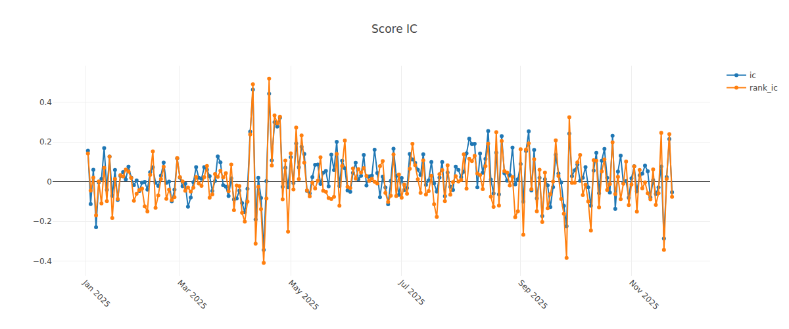
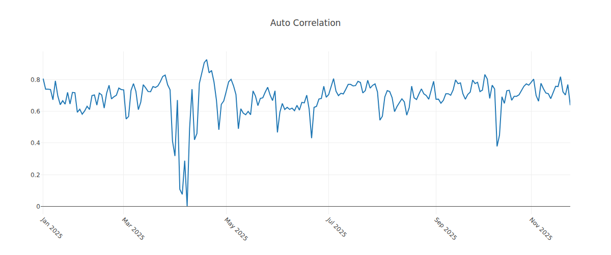

# Qlib TW Workflow

Production-style Taiwan equity workflow built on Qlib.

This repository contains:
- data pipeline and feature handlers
- model training and backtesting scripts
- full best-run dashboard artifacts
- order preparation and broker submission scripts (environment-variable credentials only)

This is the canonical working repository. Keep local-only assets here and stop editing the older private workspace once migration is complete.

## Best Configuration

| Item | Value |
|---|---:|
| Combo | `alpha158_lgb_pro_fil_ndrop2_topk50` |
| Universe size | `1072` |
| Backtest period | `2025-01-01 ~ 2025-11-25` |
| Strategy cumulative return | `22.7785%` |
| Benchmark cumulative return | `16.8312%` |
| Excess cumulative return | `+5.9473%` |
| Annualized return (with cost) | `0.037858` |
| Information ratio (with cost) | `0.236445` |
| Max drawdown (with cost) | `-0.182317` |

Reference file:
- [outputs/best_run/reports/summary.txt](outputs/best_run/reports/summary.txt)

## Dashboard

Best-run dashboard bundle is fully included under:
- `outputs/best_run/figures/`
- `outputs/best_run/figures/dashboard_snaps/` (static PNG snapshots extracted from `analysis_dashboard.html`)

Key diagnostics:
- [equity_curve.png](outputs/best_run/figures/equity_curve.png): Strategy vs benchmark
- [07_score_ic.png](outputs/best_run/figures/dashboard_snaps/07_score_ic.png): Daily information (Score IC)
- [turnover.png](outputs/best_run/figures/turnover.png): Daily turnover
- [13_model_performance_6.png](outputs/best_run/figures/dashboard_snaps/13_model_performance_6.png): model performance snapshot






Interactive dashboard files:
- [analysis_dashboard.html](outputs/best_run/figures/analysis_dashboard.html)
- [model_performance.html](outputs/best_run/figures/model_performance.html)

## Reports

Best-run reports are in `outputs/best_run/reports/`.

| File | Purpose |
|---|---|
| `summary.txt` | Final backtest summary |
| `report_normal_1day.csv` | Daily portfolio record |
| `port_analysis_1day.csv` | Portfolio risk/return metrics |
| `positions_weight.csv` | Daily position weights |
| `indicator_analysis_1day.csv` | Indicator summary |
| `indicators_normal_1day.csv` | Daily indicator table |
| `turnover_count.csv` | Count of changed instruments by day |
| `pred_label.csv` | Score-label panel |
| `daily_ic.csv` | Daily IC series |

## Setup

```bash
python3 -m venv .venv
source .venv/bin/activate
pip install --upgrade pip
pip install pyqlib lightgbm xgboost catboost pandas numpy matplotlib plotly
```

## Workflow Commands

### 1) Train models only

```bash
python3 scripts/train_tw.py --combo alpha158_lgb_pro_fil
```

### 2) Backtest using trained models

```bash
python3 scripts/backtest_tw.py \
  --combo alpha158_lgb_pro_fil \
  --n-drop 2 \
  --topk 50 \
  --strategy bucket \
  --deal-price close
```

### 3) End-to-end run (train + backtest + export)

```bash
python3 scripts/workflow_by_code_tw.py \
  --combo alpha158_lgb_pro_fil \
  --n-drop 2 \
  --topk 50 \
  --strategy bucket
```

### 4) Promote one local workflow run into the tracked public snapshot

`outputs/tw_workflow/` is for local experiment outputs and is git-ignored.
`outputs/best_run/` is the tracked public snapshot used by this repo.

```bash
python3 scripts/promote_best_run.py --combo alpha158_lgb_pro_fil_ndrop2_topk50
```

This copies `reports/` and `figures/` into `outputs/best_run/` and translates known `summary.txt` labels to English by default.

### 5) Random search helper

```bash
python3 scripts/auto_train_ic_search.py --combo alpha158_lgb --trials 20 --segment valid
```

## Order Execution Scripts

Included scripts:
- `scripts/predict_and_prepare_orders.py`
- `scripts/place_orders_from_csv.py`
- `scripts/masterlink_trade.py`
- `scripts/test_masterlink_sdk.py`

Create local env file:

```bash
cp .env.example .env.local
```

Required variables:
- `MASTERLINK_ID`
- `MASTERLINK_PASSWORD`
- `MASTERLINK_CERT`
- `MASTERLINK_CERT_PASSWORD`

Generate order list from model:

```bash
python3 scripts/predict_and_prepare_orders.py --combo alpha158_lgb --topk 50 --strategy bucket
```

Dry-run place orders from CSV:

```bash
python3 scripts/place_orders_from_csv.py outputs/live_orders/orders_alpha158_lgb_YYYY-MM-DD.csv
```

Live place orders:

```bash
python3 scripts/place_orders_from_csv.py outputs/live_orders/orders_alpha158_lgb_YYYY-MM-DD.csv --live
```

## Repository Structure

- `configs/` - pipeline/search input configs
- `scripts/` - training, backtest, workflow, strategy, exchange, and order scripts
- `outputs/tw_workflow/` - local experiment outputs, intentionally ignored
- `outputs/best_run/` - exported best-run reports and dashboards
- `Data/`, `mlruns/`, `catboost_info/`, `third_party/`, `secrets/`, `log/` - local workspace assets, intentionally ignored

## Security

- No real account, password, token, or certificate is stored in this repository.
- `.env`, secret files, and certificate file types are blocked by `.gitignore`.
- Rotate credentials immediately if previously exposed.
