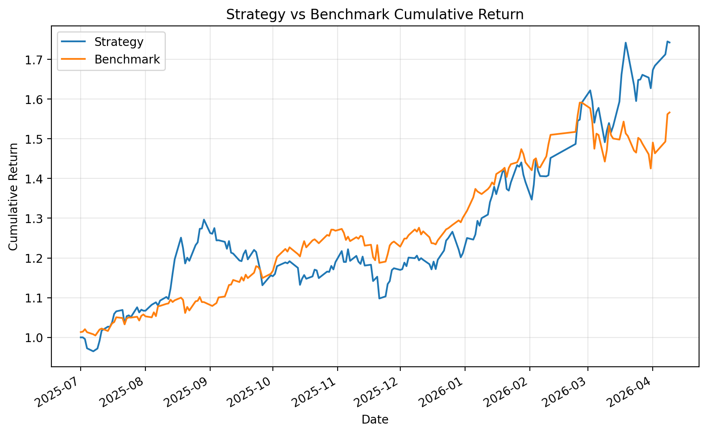
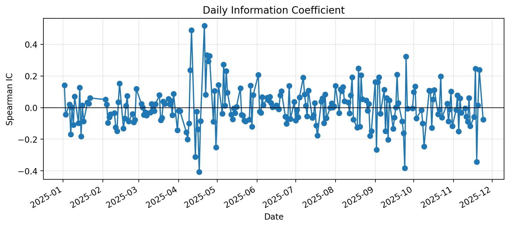
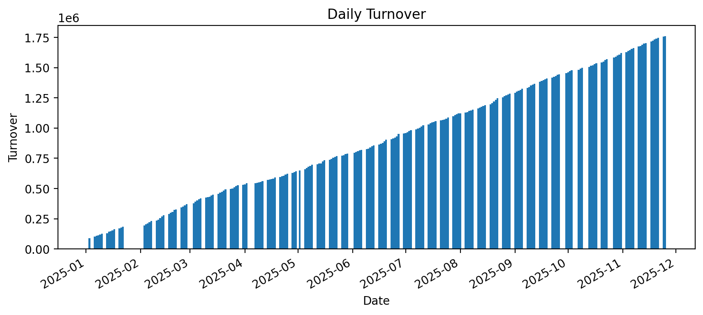

# Qlib TW Workflow

Production-style Taiwan equity workflow built on Qlib.

This repository contains:
- data pipeline and feature handlers
- model training and backtesting scripts
- full best-run dashboard artifacts
- order preparation and broker submission scripts (environment-variable credentials only)

This is the canonical working repository. Keep local-only assets here and stop editing the older private workspace once migration is complete.

## Repo Layout

- `qlib_tw/` - all importable core logic
- `qlib_tw/research/` - reusable research and backtest modules
- `qlib_tw/trade/` - reusable paper-trading and execution modules
- `scripts/research/` - research CLI entrypoints
- `scripts/trade/` - trade CLI entrypoints
- `configs/research/` - research/search configs
- `configs/trade/` - trading/execution configs

If you want to change core behavior, go to `qlib_tw/`.
If you want to change command-line behavior, go to `scripts/`.

## Current Recommended Configuration

| Item | Value |
|---|---:|
| Model combo | `alpha158_lgb_run11` |
| Search source | `outputs/auto_search_alpha158_lgb/results.csv`, `run_index=11` |
| Best strategy | `bucket`, `topk=10`, `n_drop=1` |
| Universe size | `1085` |
| Backtest period | `2025-07-01 ~ 2026-04-09` |
| Strategy cumulative return | `74.2571%` |
| Benchmark cumulative return | `56.6371%` |
| Annualized return (with cost) | `0.075833` |
| Information ratio (with cost) | `0.307939` |
| Max drawdown (with cost) | `-0.285515` |

Reference files:
- [outputs/auto_pipeline/run11_strategy_grid_20260410/grid_results_ranked.csv](outputs/auto_pipeline/run11_strategy_grid_20260410/grid_results_ranked.csv)
- [outputs/tw_workflow/alpha158_lgb_run11_scanbest_bucket_topk10_ndrop1/reports/summary.txt](outputs/tw_workflow/alpha158_lgb_run11_scanbest_bucket_topk10_ndrop1/reports/summary.txt)

## Published Snapshot

`outputs/best_run/` is the tracked public snapshot currently bundled in the repository.
If you want the dashboard artifacts below to match the latest research result, promote your chosen local run into `outputs/best_run/` first.

## Dashboard

Tracked public dashboard bundle is fully included under:
- `outputs/best_run/figures/`

Key diagnostics:
- [equity_curve.png](outputs/best_run/figures/equity_curve.png): Strategy vs benchmark
- [daily_ic.png](outputs/best_run/figures/daily_ic.png): Daily information coefficient
- [turnover.png](outputs/best_run/figures/turnover.png): Daily turnover
- [model_performance_6.html](outputs/best_run/figures/model_performance_6.html): Model performance view





Interactive dashboard files:
- [analysis_dashboard.html](outputs/best_run/figures/analysis_dashboard.html)
- [model_performance.html](outputs/best_run/figures/model_performance.html)

## Reports

Tracked public reports are in `outputs/best_run/reports/`.

| File | Purpose |
|---|---|
| `summary.txt` | Final backtest summary |
| `report_normal_1day.csv` | Daily portfolio record |
| `port_analysis_1day.csv` | Portfolio risk/return metrics |
| `positions_weight.csv` | Daily position weights |
| `indicator_analysis_1day.csv` | Indicator summary |
| `indicators_normal_1day.csv` | Daily indicator table |
| `turnover_count.csv` | Count of changed instruments by day |
| `pred_label.csv` | Score-label panel |
| `daily_ic.csv` | Daily IC series |

## Setup

```bash
python3 -m venv .venv
source .venv/bin/activate
pip install --upgrade pip
pip install pyqlib lightgbm xgboost catboost pandas numpy matplotlib plotly
```

## Workflow Commands

### 1) End-to-end run (train + backtest + export)

```bash
python3 scripts/research/workflow_by_code_tw.py \
  --combo alpha158_lgb_run11 \
  --n-drop 1 \
  --topk 10 \
  --strategy bucket
```

### 2) End-to-end run directly from search results

```bash
python3 scripts/research/workflow_by_code_tw.py \
  --combo alpha158_lgb \
  --from-search outputs/auto_search_alpha158_lgb/results.csv \
  --run-index 11 \
  --n-drop 1 \
  --topk 10 \
  --strategy bucket \
  --run-name alpha158_lgb_searchrun11
```

### 3) Promote one local workflow run into the tracked public snapshot

`outputs/tw_workflow/` is for local experiment outputs and is git-ignored.
`outputs/best_run/` is the tracked public snapshot used by this repo.

```bash
python3 scripts/research/promote_best_run.py --combo alpha158_lgb_run11_scanbest_bucket_topk10_ndrop1 --clean
```

This copies `reports/` and `figures/` into `outputs/best_run/` and translates known `summary.txt` labels to English by default.

### 4) Random search helper

```bash
python3 scripts/research/auto_train_ic_search.py --combo alpha158_lgb --trials 20 --segment valid
```

Pipeline config example:

```bash
python3 scripts/research/auto_search_pipeline.py --config configs/research/auto_search_pipeline.example.json
```

## Order Execution Scripts

Included scripts:
- `scripts/trade/predict_and_prepare_orders.py`
- `scripts/trade/place_orders_from_csv.py`
- `scripts/trade/masterlink_trade.py`
- `scripts/trade/test_masterlink_sdk.py`

Create local env file:

```bash
cp .env.example .env.local
```

Required variables:
- `MASTERLINK_ID`
- `MASTERLINK_PASSWORD`
- `MASTERLINK_CERT`
- `MASTERLINK_CERT_PASSWORD`

Generate order list from model:

```bash
python3 scripts/trade/predict_and_prepare_orders.py --combo alpha158_lgb --topk 50 --strategy bucket
```

Dry-run place orders from CSV:

```bash
python3 scripts/trade/place_orders_from_csv.py outputs/live_orders/orders_alpha158_lgb_YYYY-MM-DD.csv
```

Live place orders:

```bash
python3 scripts/trade/place_orders_from_csv.py outputs/live_orders/orders_alpha158_lgb_YYYY-MM-DD.csv --live
```

Paper trading replay:

```bash
python3 scripts/trade/paper_trade_daily.py \
  --config configs/trade/paper_trading.alpha158_lgb_run11_tplus.example.json \
  --target-date 2026-04-11
```

Paper trading scheduler wrapper:

```bash
bash scripts/trade/run_paper_trade_daily.sh
```

Container-friendly long-running scheduler:

```bash
nohup bash scripts/trade/run_paper_trade_scheduler.sh >/dev/null 2>&1 &
```

This checks Taipei time continuously and triggers the paper-trading wrapper at `08:30` and `20:00`.

Cron example:

```bash
crontab -e
```

Then paste the line from:

```text
configs/trade/paper_trade_daily.crontab.example
```

Recommended pattern:

- Run once before market open to refresh the preview order list.
- Run once after market close to refresh actual simulated fills and account state.

Execution grid search:

```bash
python3 scripts/trade/execution_grid_search.py \
  --config configs/trade/execution_grid.alpha158_lgb_run11_1m_tplus.json
```

## Repository Structure

- `qlib_tw/` - importable core package
- `configs/research/` - research/search configs
- `configs/trade/` - trade/paper-trading configs
- `scripts/research/` - research CLI entrypoints
- `scripts/trade/` - trade CLI entrypoints
- `outputs/tw_workflow/` - local experiment outputs, intentionally ignored
- `outputs/best_run/` - exported best-run reports and dashboards
- `Data/`, `mlruns/`, `catboost_info/`, `third_party/`, `secrets/`, `log/` - local workspace assets, intentionally ignored

## Security

- No real account, password, token, or certificate is stored in this repository.
- `.env`, secret files, and certificate file types are blocked by `.gitignore`.
- Rotate credentials immediately if previously exposed.
